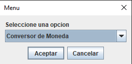
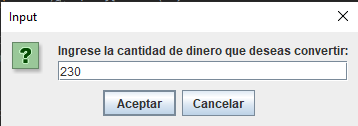
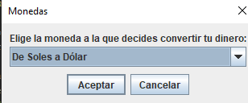
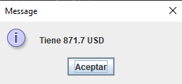

# Challengue_Conversor_de_moneda
Conversor de moneda implementado en Java con una interfaz gráfica desarrollada en Java Swing. Facilita la conversión rápida y precisa entre diferentes divisas, brindando una experiencia intuitiva y funcional.

## Requisitos previos

Antes de ejecutar el proyecto, asegúrate de tener instalado lo siguiente:
1. JDK 8 o superior (Java Development Kit)
2. NetBeans IDE 17

## Capturas de pantalla

A continuación, se muestran algunas capturas de pantalla del funcionamiento del proyecto

1. Menu principal:
	
 

2. Ventana entrada de datos:
	
 

3. Ventana para elegir divisas de conversion:

 

4. Resultado de la conversion:

 
